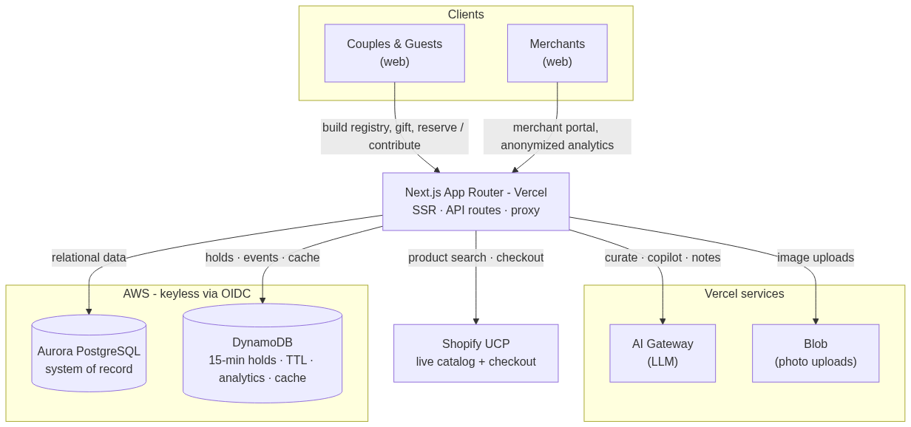
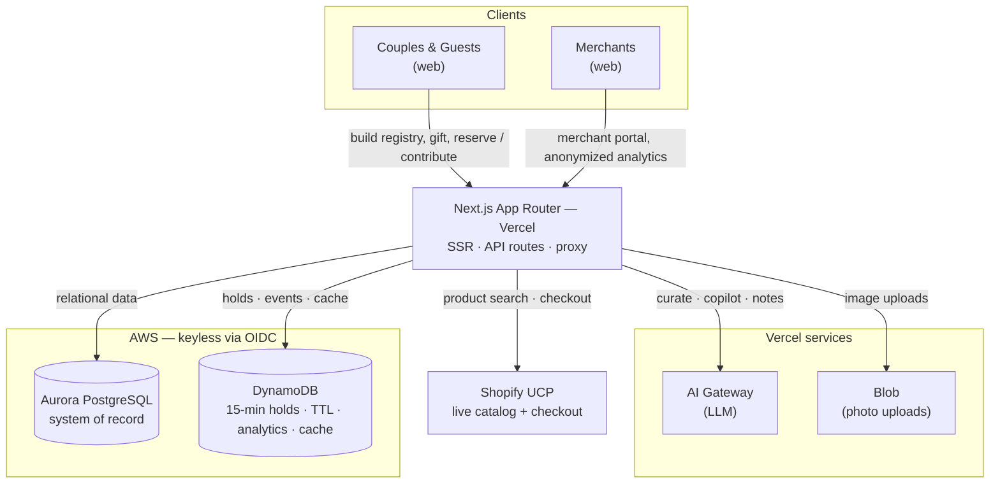

# VowCart — AI-Powered Universal Wedding Registry

> A universal wedding registry that pulls real products from **any** Shopify merchant, lets AI build and manage it for couples, and turns aggregate registry demand into privacy-safe analytics for brands.

**Track:** Monetizable B2C app (with a built-in B2B analytics/ads revenue side)
**AWS Databases used:** **Aurora PostgreSQL** (relational system of record) **+ Amazon DynamoDB** (TTL-based reservation locks, analytics events, AI response cache)
**Frontend & hosting:** Next.js on **Vercel**

- **Live app:** `https://vowcart-ai-powered-wedding-registry.vercel.app`
- **Vercel Project / Team ID:** _add from Vercel dashboard_

---

## Architecture

**How the pieces connect**

- **Next.js on Vercel** serves both the couple-facing app and the separate merchant portal, and hosts all API routes.
- **Aurora PostgreSQL** is the relational source of truth — couples, registries, registry items, purchases, group-gift/cash-fund contributions, merchants, and sponsored campaigns.
- **DynamoDB** handles ephemeral, high-velocity, TTL-driven state: 15-minute reservation locks that auto-expire, analytics events, and an AI response cache.
- **Vercel AI Gateway** runs the LLM features (registry curation, AI Copilot, recommendations, thank-you notes).
- **Shopify Universal Commerce Protocol** provides keyless live product search across the global catalog and merchant checkout handoff.
- **Vercel Blob** stores uploaded cover and gift photos.
- **OIDC** lets Vercel deployments assume an AWS role to reach Aurora and DynamoDB with **no long-lived secrets**.

---

## Market & why now

**A large, resilient market.** Weddings are one of the most durable consumer-spend categories there is: **~2.0M weddings per year in the US** ([CDC/NCHS reported ~2.04M marriages in 2023][cdc]; [The Wedding Report][twr] estimates ~2.0M weddings in 2024–25), inside a **~$63–70B/year US wedding industry** ([Grand View Research: $64.9B in 2024][gvr]; [IBISWorld: $70.3B in 2023][ibis]) and a global wedding-services market estimated at **$250B+** and growing double digits ([Grand View Research][gvr-global]).

**The registry is the commerce core of it.** About **91% of couples create a wedding registry**, and — for the first time — online registry creation (55%) has overtaken in-store (44%) ([The Knot][knot-insights]). Guests spend an average of **~$150 per wedding gift** ([The Knot 2024 Guest Study][knot-gift]), against an average US wedding cost of **~$33,000** ([The Knot 2024 Real Weddings Study][knot-rws]). The **digital wedding registry market itself** is estimated at roughly **$16B in 2025, projected to ~$50B by 2033 (~14.8% CAGR)** ([market research, 2025][reg-market]). And the same registry primitive powers adjacent, year-round occasions — baby showers, housewarmings, birthdays, holidays — so the model extends well beyond weddings.

**Why today's registries aren't actually universal.** The incumbents — Zola, The Knot, Amazon, Target, Crate & Barrel — build their catalogs through **merchant partnerships and one-off integrations**. Every brand on the platform is the result of a BD deal plus custom engineering, so even a "universal" registry is really a curated set of a few hundred partner brands. "Add any item" usually degrades to "paste a link we can't transact on," and most independent / DTC brands are simply missing. The catalog is gated by business development, not by what couples actually want to shop.

**Why now — UCP changes the unit economics.** Shopify's **Universal Commerce Protocol (UCP)** flips that model. Instead of integrating merchants one at a time, an app gets **programmatic, keyless access to entire commerce catalogs and checkout through a single protocol**. Starting with the **Shopify ecosystem** — millions of merchants and a huge share of modern DTC/independent brands — the addressable product universe jumps from "our partner catalog" to **the open commerce graph**, effectively overnight. That is the entire thesis behind VowCart:

- Couples get a **genuinely universal** registry — any product from any Shopify merchant, actually transactable, not a dead link.
- The catalog scales with **zero per-merchant BD or integration cost**, making the product viable for a small team and compounding as UCP adoption grows.
- A broader, more relevant catalog lifts **gift conversion** — which makes the **anonymized demand analytics** we sell to brands meaningfully more valuable.

UCP is the reason a truly universal registry is suddenly buildable — and why the timing is now.

Sources: figures are from third-party industry research and may use differing methodologies; ranges are given where estimates vary.

[cdc]: https://www.cdc.gov/nchs/fastats/marriage-divorce.htm
[twr]: https://wedding.report/index.cfm/action/wedding_statistics/view/market/id/00/idtype/s/location/United_States/
[gvr]: https://www.grandviewresearch.com/industry-analysis/us-wedding-services-market-report
[ibis]: https://www.ibisworld.com/industry-statistics/market-size/wedding-services-united-states/
[gvr-global]: https://www.grandviewresearch.com/industry-analysis/wedding-services-market-report
[knot-insights]: https://www.theknot.com/content/wedding-data-insights
[knot-gift]: https://www.theknot.com/content/how-much-to-spend-on-wedding-gifts
[knot-rws]: https://www.theknot.com/content/wedding-data-insights/weddings-in-2024
[reg-market]: https://www.openpr.com/news/4192605/digital-wedding-registry-market-is-booming-worldwide-major

---

## Inspiration

Wedding registries are stuck in the past. Every store runs its own — so couples end up with three or four registries, and guests bounce between sites just to find something to buy. The result: duplicate gifts, abandoned big-ticket items nobody wants to buy alone, and hours of tedious curation for the couple.

Two things stood out to us. First, **registries are pure purchase-intent data** — a couple literally listing what they're about to buy and from which brands — yet the merchants behind those products never get to see that demand. Second, **the curation itself is a perfect job for AI**: "we love slow mornings and hosting friends" should be enough to generate a beautiful, personalized registry in seconds.

So we built VowCart: one **universal** registry that pulls real products from _any_ Shopify merchant, an AI that does the heavy lifting for couples, and a privacy-respecting analytics layer that turns aggregate registry demand into something brands can actually act on.

## What it does

VowCart is a **two-sided** product.

**For couples & guests (B2C):**

- **AI-built registry** — answer a few lifestyle questions and an LLM curates a starter registry of _real_ products, pulled live from Shopify's Universal Commerce Protocol catalog.
- **Truly universal** — search and add products from any Shopify merchant; nothing is locked to a single store.
- **AI Copilot** — chat to shape the registry ("add more under $75," "make it more minimalist," "remove expensive gifts") and approve proposed changes.
- **Group gifting & cash funds** — let multiple guests rally toward a big-ticket item or a "Honeymoon in Italy" fund, with a live progress bar.
- **Reservations & checkout** — guests reserve a gift (a 15-minute hold) or buy it via the merchant's real Shopify checkout; the item is auto-held for 15 minutes the moment a purchase starts so nothing gets double-bought.
- **Thank-you tracker** — AI-generated thank-you notes in different tones, plus a beautiful public page and a scannable QR code for invitations.

**For brands (B2B / monetization):**

- A **separate merchant portal** with its own auth showing **anonymized, aggregated demand analytics** — which products and categories are being added and purchased across the network, and at what conversion.
- **Sponsored placements** that brands can pay to promote, always rendered to couples with a clear "Sponsored" label.

## How we built it

- **Frontend & hosting:** Next.js (App Router) + React + TypeScript + Tailwind, deployed on **Vercel**.
- **Aurora PostgreSQL** — our **system of record**: couples, registries, registry items, purchases, contributions (group gifts/cash funds), merchants, and sponsored campaigns.
- **DynamoDB** — for everything ephemeral and high-velocity: **reservation locks with native TTL** (15-minute holds that auto-expire), analytics events, and an AI response cache.
- **Vercel AI Gateway** — powers the real AI features (registry curation, the Copilot, "For You" recommendations, and thank-you notes).
- **Shopify Universal Commerce Protocol (UCP)** — keyless live product search across the global catalog and merchant checkout handoff, so the registry is genuinely universal.
- **Vercel Blob** — couple cover-photo and gift-photo uploads.
- **Keyless AWS access via OIDC** — Vercel deployments assume an AWS role to reach Aurora and DynamoDB with no long-lived secrets; a seed-data fallback keeps local dev fully functional.

## Challenges we ran into

- **Aurora Serverless cold starts.** After idle, the first request could exceed our connection timeout. We tuned the pool timeout, raised route `maxDuration`, added keep-alive and a one-shot retry, and the experience smoothed out.
- **Making reservations actually mean something.** The 15-minute hold lived in DynamoDB but was never read back, so other guests didn't see it. We added a lock overlay on the public registry so a held gift shows as "Reserved" to _everyone_, and extended holds to trigger when a purchase begins.
- **Picking the right database for each job.** Pushing fast-expiring reservation locks into Postgres would have meant a cleanup job; DynamoDB's TTL does it for free. Keeping relational integrity (purchases ↔ items ↔ couples) in DynamoDB would have been painful. Splitting responsibilities cleanly was a real design exercise.
- **Privacy-safe B2B analytics.** Brands get demand signal without ever seeing individual couples or guests — all metrics are aggregated and anonymized.
- **Reliable AI output.** Getting the LLM to return grounded, parseable curation (real product titles, correct counts) meant prompt iteration plus rule-based fallbacks so the app never breaks if the model wanders.

## Accomplishments that we're proud of

- A registry that's **genuinely universal** — any product from any Shopify merchant, not a walled garden.
- A **real two-sided business**: a delightful B2C experience _and_ a B2B analytics/ads product with a clear monetization model (sponsored placements + premium), built on one shared commerce graph.
- **AI that's useful, not a gimmick** — it builds the registry, edits it conversationally, recommends, and writes the thank-you notes.
- **Privacy by design** on the merchant side: actionable demand insights with zero exposure of individual users.
- A polished, mobile-friendly product running entirely on **Vercel + Aurora PostgreSQL + DynamoDB** with no servers to manage and keyless AWS auth.

## What we learned

- **Headless commerce via Shopify UCP** lets you build a universal storefront/registry without integrating each merchant one by one.
- **Use the right datastore for the data's shape:** Aurora PostgreSQL for relational truth and reporting; DynamoDB for ephemeral, high-write, TTL-driven state. The combination is more than the sum of its parts.
- **Vercel AI Gateway** makes swapping/operating models trivial, and **OIDC** removes the whole class of "where do we store AWS keys" problems.
- A **seed-fallback architecture** keeps local development fast and fully functional even when the cloud datastores aren't reachable.

## What's next for VowCart: AI-Powered Universal Wedding Registry

- **Real payment rails** (e.g., Stripe) so cash funds and group gifts actually collect money, not just track pledges.
- **Live reservation updates** pushed to open tabs so holds appear in real time without a refresh.
- **Deeper merchant analytics + self-serve campaign billing** to turn the B2B side into real revenue.
- **Multi-merchant cart & checkout** so a guest can buy several gifts across brands in one flow.
- **Couple vanity domains** and **native mobile apps** for an even more polished experience.

---

## Built with

`Next.js` · `React` · `TypeScript` · `Tailwind CSS` · `Vercel` · `Aurora PostgreSQL` · `Amazon DynamoDB` · `Vercel AI Gateway` · `Vercel Blob` · `Shopify Universal Commerce Protocol` · `AWS OIDC`
